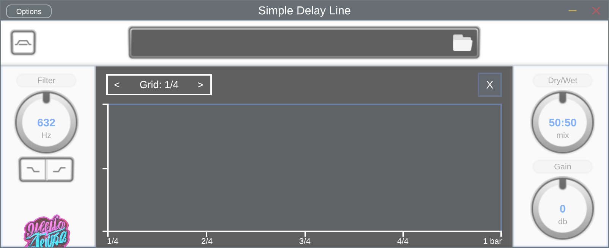
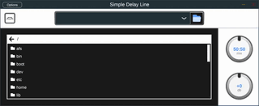
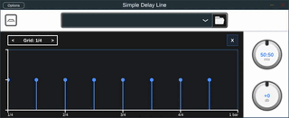
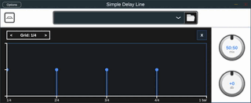

# Stereo Multitap Delay Plugin


This plugin allows you to create stereo multitap delay effects in your audio projects.

## Key Features
- Easily load and mange preset files directly within the plugin
  - Browse your file system and select preset files to instantly hear new presets



- Draw delay timestamps on a canvas
  - Adjust position and amplitude of each timestamp 



- Single and multichannel delay modes
  - Select between processing the left (L), right (R), or both channels 



- Adjustable wet/dry mix
  - Top right rotary slider controls blend between dry input signal and wet delayed signal
- Output gain adjustment
  - Bottom right rotary slider controls overall output level after processing

The plugin provides an intuitive interface for placing delay taps at specific timestamps in your audio. Each tap can be individually controlled for timing and volume. Switch between single or multichannel modes to apply delays independently on the left and right channels.

Use the wet/dry mix control to blend the delayed signals with the original dry input. Increase or decrease the overall output gain without affecting the delay balance.

Built on the powerful [JUCE framework](https://juce.com/), this plugin enables creative stereo delay effects directly in your DAW. Shape complex rhythmic delays, widen the stereo image, or add subtle ambience to your tracks.

The delay canvas provides a visual way to design delays. Simply click to add new timestamps, drag them around to adjust timing, and change their height to control volume. Listen in realtime as you sculpt the delay sound.

Whether you're an electronic musician, producer, or engineer, this stereo multitap delay is an essential tool for adding depth and space to your mixes. Download it today and enhance your tracks with customizable delay effects!

## Key Shortcuts

| Key | Action |
|-|-|
| Double click | Create or delete timestamp |
| Click + drag | Adjust timestamp position |
| Ctrl + drag | Lock to horizontal movement |

Double clicking on the delay canvas will create a new timestamp or delete an existing one.

Clicking and dragging a timestamp will adjust its position in time relative to the start of the audio.

Holding Ctrl while dragging will lock the movement to the horizontal axis, allowing you to change timing without altering vertical position.

The shortcuts provide an efficient way to add, position, and remove delay taps as you design your delay sound. With just the mouse and keyboard, you can precisely control the multitap delays and sculpt creative rhythmic effects.

## Build and Install

To build and install the plugin:

1. Download and install the [JUCE framework](https://juce.com/get-juce).

2. Clone the plugin repository:

    ```
    git clone https://github.com/https://github.com/jaeckl/stereo-multitap-delay
    ```

3. Create a build directory and run CMake:

    ```
    mkdir build
    cd build
    cmake .. -DCMAKE_PREFIX_PATH=/path/to/JUCE
    ```

4. Build the plugin:

    ```
    cmake --build . -j8
    ```

5. Install the plugin to your system:

    ```
    sudo cmake --install .
    ```

Now the Stereo Multitap Delay plugin will be installed and ready to use in your DAW.

CMake will generate the platform specific build files and handle the compilation based on your system. Make sure to set the `CMAKE_PREFIX_PATH` to your JUCE install location.

The compiled plugin binaries, presets, and other resources will be properly installed to the standard system locations for your platform. After installing, you can use the plugin in your audio projects!

Let me know if you have any other questions about building and installing the plugin.
